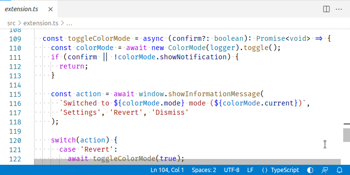

<h1>
 <strong>DarkLight</strong>
</h1>

Color mode switcher for Visual Studio Code

## Features

Adds action to easily switch between dark and light color mode:

- From status bar

  Click the `color-mode` button in VS Code status bar to toggle the dark or light color mode  

- Using keyboard shortcuts

  Use <kbd>CTRL</kbd>+<kbd>T</kbd>, <kbd>CTRL</kbd>+<kbd>K</kbd> to toggle the dark or light color mode

## License

This project is licensed under the terms of [The MIT license](LICENSE).
